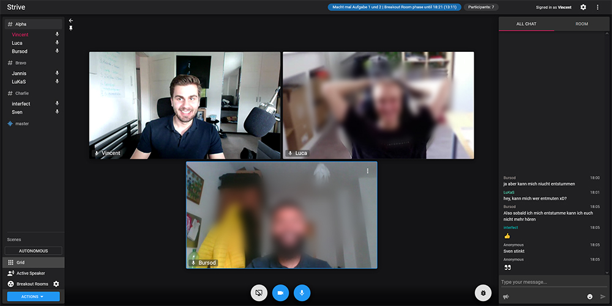

[](https://github.com/Anapher/Strive/actions/workflows/asp-net-core-test.yml)
[](https://dashboard.cypress.io/projects/coci4n/runs)
[](https://codecov.io/gh/Anapher/Strive)
[](https://codeclimate.com/github/Anapher/Strive/maintainability)
[](./LICENSE)

<br />
<p align="center">
  <h1 align="center">Strive</h1>

  <p align="center">
    Open source video conference system
    <br />
    <br />
    <a href="https://demo.openstrive.org/">View Demo</a>
    ·
    <a href="https://github.com/Anapher/Strive/issues">Report Bug</a>
    ·
    <a href="https://github.com/Anapher/Strive/issues">Request Feature</a>
  </p>
</p>



## Table of content

- [About the project](#about-the-project)
    - [Features](#features)
    - [Architecture](#architecture)
- [Getting Started](#getting-started)
    - [Running on localhost with Docker Compose and Traefik](#running-on-localhost-with-docker-compose-and-traefik)
    - [Running on production server](#running-on-production-server)
    - [Development](#development)
    - [Known Issues](#known-issues)
- [Contributing](#contributing)
- [License](#license)
- [Acknowledgements](#acknowledgements)

**This is a very new project and I'm very thankful for all kinds of contributions including**
- design suggestions
- typos or if you think something is worded poorly
- feature ideas
- bug reports
- problems you have for a specific use case
- and basically all your thoughts about Strive

## About The Project
Last year when I was tutor at my university, I had to use BigBlueButton which was a very frustrating experience. I wondered how hard it can be to create a video conference system and that's how Strive was started. You can find a list with issues of BBB I wanted to address [here](./advantages_over_bbb.md).


### Features

- Flexible Permission System
- Breakout Rooms
- Screen Share
- Multiple scenes (grid, active speaker)
- Presenter mode
- Room Chat & Global Chat, anonymous chat messages
- Equipment / use smartphone as webcam by scanning a QR code
- Talking Stick / moderated talking
- Reduce traffic using WebRTC simulcast
- Up-to-date and responsive UI
- Announcements / show a message to all participants, also those in breakout rooms
- Horizontal and vertical scalability (some small things are still to do, but the architecture allows it)
- Polls (single choice, multiple choice, numeric, tag cloud)


### Architecture


#### WebSPA
The frontend, written with React/TypeScript. Basically everything you see.

#### Identity Microservice
Manages the authentication process. This is basically an [OpenID Connect](https://openid.net/connect/) server that provides the frontend for the login aswell as managing the access/refresh tokens.

#### Selective Forwarding Unit (SFU)
Redirects the media traffic (audio/video) between the participants.

#### Conference Management
This is the heart of Strive, here are conferences created, chat messages delivered, rooms created etc.

<!-- GETTING STARTED -->
## Getting Started

### Running on localhost with Docker Compose and Traefik
1. Clone the repo
   ```sh
   git clone https://github.com/Anapher/Strive.git
   ```
   
2. Got to src directory
   ```sh
   cd src/
   ```
3. Execute docker compose using the script
   - On Windows, execute
   ```powershell
   ./compose.ps1 up --build
   ```
   - On Linux, execute
   ```sh
   chmod +x ./compose.sh && ./compose.sh up --build
   ```
4. Go to `https://localhost` using your favorite browser. Please note that you may have to trust the self signed certificate for localhost. If you are using Google Chrome, you can simply enable this option `chrome://flags/#allow-insecure-localhost` (just paste it in the address bar)
   
In the `.env` file you can change some parameters, but they are already preconfigured for local testing.

### Running on production server
Please refer to the [installation instructions](./installation.md).

### Development
For developing, you likely want to focus on one microservice only. First of all, you need to setup the infrastructure, namely a RabbitMQ server (with delayed message exchange plugin) and a MongoDB database, both running on default ports.
The easiest way to do so is by executing
   ```sh
   docker-compose -f docker-compose.yml -f docker-compose.override.yml up nosqldata rabbitmq
   ```
   
Then you need to start the required microservices you do NOT want to modify:
- Identity microservice (runs on `http://localhost:55105`):
   ```sh
   cd src/Services/Identity/Identity.API && dotnet run
   ```
- WebSPA (runs on `http://localhost:55103`):
   ```sh
   cd src/Web/WebSPA && dotnet run
   ```
  Do not use yarn start in the ClientApp folder, as the ASP.Net Core app injects some parameters required for the frontend to work. Fast refresh will still work in the React app.
- SFU (runs on `http://localhost:3000`)
   ```sh
   cd src/Services/SFU && yarn dev
   ```
- Conference Management (runs on `http://localhost:55104`)
   ```sh
   cd src/Services/ConferenceManagement/Strive && dotnet run
   ```
Do not change these ports as they are configured to work together in a local development environment. You can then attach a debugger to the microservice you want to change. For ASP.Net Core projects, instead of executing this command you may also open the solution with Visual Studio and run the debugger here.

### Known Issues
- Firefox will not connect to the SFU on localhost (in simple language, if you are running Strive on localhost, you cannot use your microphone, webcam, etc.) as Firefox has [limitations for ICE over TCP](https://mediasoup.discourse.group/t/firefox-ice-failed-add-a-stun-server-and-see-about-webrtc-for-more-details/805). For local development, I suggest to use a different browser (e. g. Google Chrome).

<!-- CONTRIBUTING -->
## Contributing

Contributions are what make the open source community such an amazing place to be learn, inspire, and create. Any contributions you make are **greatly appreciated**.

1. Fork the Project
2. Create your Feature Branch (`git checkout -b feature/AmazingFeature`)
3. Commit your Changes (`git commit -m 'Add some AmazingFeature'`)
4. Push to the Branch (`git push origin feature/AmazingFeature`)
5. Open a Pull Request


<!-- LICENSE -->
## License

Distributed under the Apache-2.0 License. See `LICENSE` for more information.


<!-- ACKNOWLEDGEMENTS -->
## Acknowledgements
* [ASP.Net Core](https://docs.microsoft.com/en-us/aspnet/core)
* [mediasoup](https://mediasoup.org/)
* [Material-UI](https://material-ui.com/)
* [React Hook Form](https://react-hook-form.com/)
* [Duende IdentityServer](https://duendesoftware.com/)
* [eShopOnContainers](https://github.com/dotnet-architecture/eShopOnContainers)
